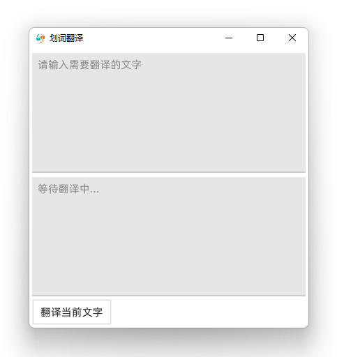
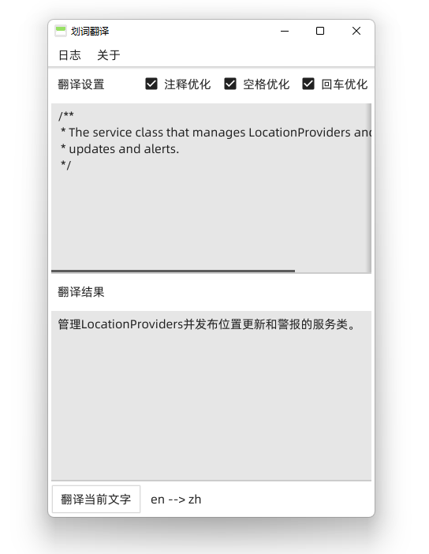

# EzeTranslate

 

 

利用 go 实现的一款 Windows 和 Linux 下通用的翻译小工具

避免不厌其烦的在 chrome\IDE\PDF 工具上安装翻译拓展...

另外针对代码注释的翻译做特殊格式化

## Feature
- 翻译 API 接口的单词, 语句翻译
  - 支持 Baidu 翻译 API
    - 需要在 config.yaml 当中配置 Baidu API 参数
  - 支持 Google 翻译 API
    - 国内的话, 需要在 config.yaml 当中配置 translate.google.com 的代理
    - 可以使用 cloudflare worker 做 js proxy 
- 针对代码注释进行格式化
  - 去除 `//` `/*` `#` 之类的符号
  - 去除回车, 多余空格等
- 划词翻译 (仅支持 Linux, 需要 xclip )
- xxxxxxxxx TODO

# ScreenShot

## Windows 运行效果

|   启动页面   |   翻译效果   |
| ---- | ---- |
|      |      |

