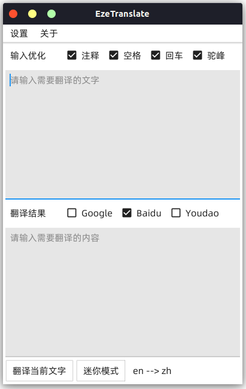
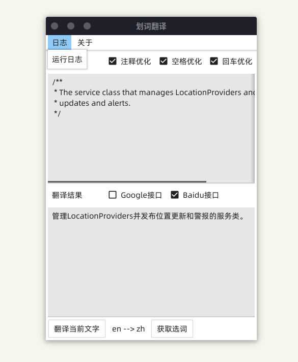

# EzeTranslate

<br>


<br>

利用 go 实现的一款 Linux 和 Windows 下通用的翻译小工具（我自己一直在 Ubuntu 下使用）

避免不厌其烦的在 chrome\IDE\PDF 工具上安装翻译拓展...

另外针对代码注释的翻译做特殊格式化

版本发布日志: [Release Log](RELEASE_LOG.md)

## 1. 特性
- 支持多个翻译接口，可便捷切换
  - 支持 Baidu 翻译 API
    - 需要在参数设置当中配置 Baidu API 参数
  - 支持 Google 翻译 API
    - 无需设置 API 参数，但是需要解决网络访问问题
    - 支持设置 google 翻译地址 (你可以直接做一个 js proxy 来访问)
    - 支持设置 Http 代理解决访问问题
  - 支持 Youdao 翻译 API
    - 需要在参数设置当中配置 Youdao API 参数
- 针对代码注释进行格式化
  - 去除 `//` `/*` `#` 之类的符号
  - 去除回车, 多余空格等
  - 驼峰命名法的变量和函数名翻译
- 划词翻译 (仅支持 Linux, 需要 xclip )
- 英文 OCR 支持 (仅支持 ubuntu，需要 gnome 桌面环境以及 tesseract)
- 简约窗口（无菜单/设置等，只有简单卡片显示翻译结果）

## 2. 安装

### Release 下载
直接前往 [Release](https://github.com/Ericwyn/EzeTranslate/releases) 下载即可

### 编译安装
```shell
git clone https://github.com/Ericwyn/EzeTranslate.git
go mod tidy
sh build.sh 
# windows 的话运行 ./build.bat
```
编译得到的运行文件会在 `build-target` 文件夹内

因为项目所用 GUI 框架为 FYNE

所以编译和运行过程中如果遇到问题可参考 [Fyne:Getting Start](https://developer.fyne.io/started/) 及 [Fyne: Github Issue](https://github.com/fyne-io/fyne/issues)


## 3. 运行
- 运行程序
- 菜单 -> 设置 -> 程序设置中, 配置各项参数
- 运行程序

### Linux 划词翻译支持
- 安装 xclip
- 为 `EzeTranslate -x` 命令设定快捷键
  - 此处 `-x` 参数可以在程序启动之后直接调用 xclip 获取屏幕划词并翻译

### Ubuntu 下英文 OCR 识别支持
- 暂时只支持 Ubuntu, 依赖于 `gnome-screenshot` , 以及 `tesseract`
  - 实现上直接调用 `gnome-screenshot` 命令行截图，之后再用 `tesseract` 识别
- 需要安装 tesseract, ubuntu 可用以下命令安装
  ```shell
  sudo apt-get install tesseract-ocr
  sudo apt-get install tesseract-ocr-eng
  ```

## 4. 待实现功能
- Linux
- Windows
  - windows 监听剪贴板, 快速翻译
  - windows IPC 支持
- All
  - 窗口创建的时候位置跟随鼠标
  - 鼠标移开时候自动退出
  - 多个翻译任务的时候, 停止之前的任务
- ...

# 5. 程序截图

## Ubuntu 20.04 运行效果

|   启动页面   |   翻译效果   |   迷你窗口   |
| ---- | ---- | ---- |
|      |      |   |
